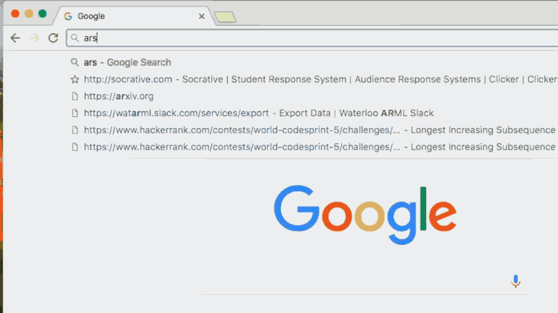

# Falcon

Chrome extension for flexible full text browsing history search. **Press `f`, then `space` or `tab`, in the omnibar to start searching your previously visited websites**! 

Every time you visit a website in Chrome, Falcon indexes all the text on the page so that the site can be easily found later. Then, for example, if you type `f <tab> mugwort`, Falcon will show the websites you visited containing the text "mugwort"! [Install from the Chrome store here](https://chrome.google.com/webstore/detail/falcon/mmifbbohghecjloeklpbinkjpbplfalb) or [get the CRX file](https://github.com/lengstrom/falcon/releases/tag/0.1.4)! (If you don't feel comfortable with that, look at [Transparent Installation](#transparent-installation)). Programmed by [@andrewilyas](https://github.com/andrewilyas) and [@lengstrom](https://github.com/lengstrom), art by [Lucia Liu](http://lucialiu.me).

## Examples

`before: "yesterday at 5pm" after: "three weeks ago" emscripten blog "anish athalye"` 
- Searches for websites that you browsed between yesterday at 5pm and 3 weeks ago containing the keywords "emscripten" and "blog" and "anish athalye"

`-"cat food" just "a dog"`
- Searches for websites you visited containing the keywords "just" and "a dog", and without the phrase "cat food".

`ethereum medium` 
- Searches for websites you visited in the last 2 weeks containing the keywords "ethereum" and "medium"

`ethereum medium after:11/29/2015 before:3/26/2016` 
- Searches for websites you visited between 11/29/2015 and 3/26/2016 containing the keywords "ethereum" and "medium"

## Transparent Installation
If you don't feel comfortable installing a Chrome extension that can read and modify all data on the websites you visit from the webstore (we wouldn't either!), you can clone it on your local machine, read through our code to verify that it is not malicious, and then install it as an unpacked local extension through the menu in `chrome://extensions/`. This way you also won't receive any automatic updates, as well. 

## Preferences Page
To manage which URLs Falcon can index, delete websites from the index, and more, go to the preferences page.

## FAQ
### "Will this index my bank statements?"
Nope! We have a blacklist of domains to avoid indexing that includes the majority of banking websites. You can edit them and add your own in the preferences page! If you accidentally visit a page that is indexed that you don't want indexed, you can go into preferences and delete it from your indexed pages. 

### "Do you store any information remotely?"
No, all information is stored locally! No data leaves your computer over the network.

## More Details
- Use `before:date` and `after:date` to search your history in a certain time range
  - You can use natural language along with quotes to specify dates as well, e.g. `before:"yesterday at 5pm"`
- Use quotations to look for exact matches of strings containing whitespace
- Only documents containing all words will be returned
